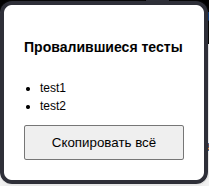

# Парсер упавших тестов
Парсит результаты тестов и выводит наименования тегов в виде списка.

## Интерфейс

Скопировать все - копирует все теги в буффер обмена через запятую для комфортной вставки

## Использование
1. Открыть страницу настроек [расширений](chrome://extensions/)
2. Включить режим разработчика
3. Нажать на кнопку "Загрузить распакованное расширение" / “Load unpacked”
4. Выбрать папку с расширением